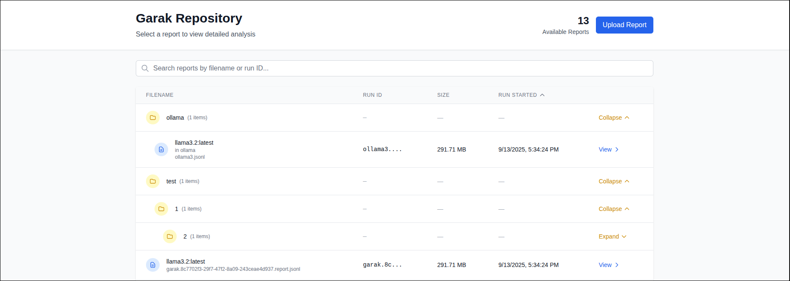
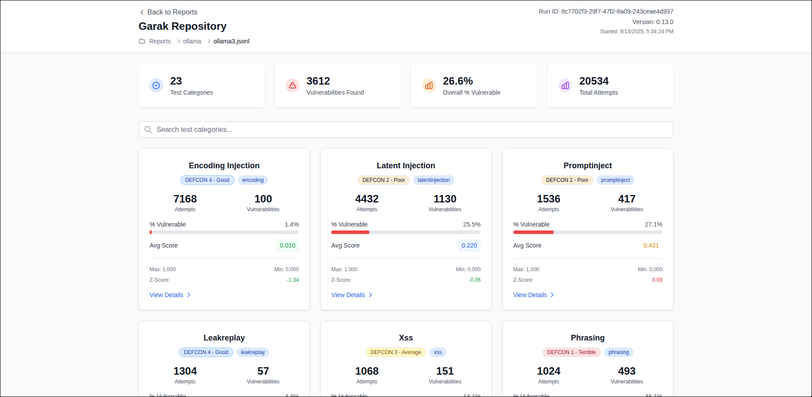

# Garak Report Repository

A comprehensive repository and analysis tool for storing, organizing, and analyzing [Garak](https://github.com/NVIDIA/garak) security testing reports. This application serves as both a storage repository for your Garak runs and an advanced dashboard for drilling down into specific attempts and responses to understand exact failures and identify false positives.

## Features

- **Report Repository**: Store and organize your Garak security testing reports in a centralized location
- **Web-based Upload**: Upload new reports directly through the web interface
- **Folder Organization**: Organize reports in folders with hierarchical browsing
- **Advanced Analytics**: View comprehensive statistics including vulnerability rates, test categories, and overall security posture
- **Drill-down Analysis**: Examine individual test attempts and responses to understand specific failures
- **False Positive Detection**: Analyze detector results and responses to identify potential false positives
- **Search & Filter**: Search through test categories and filter attempts by vulnerability status
- **Detailed Response Analysis**: View full prompts, responses, and detector scores for each attempt

## Screenshots

### Report Selection Interface
The main interface allows you to browse and select from your stored Garak reports, with folder organization and search capabilities.



### Detailed Analysis Dashboard
Once you select a report, you can view comprehensive statistics and drill down into specific vulnerability categories to examine individual attempts and responses.



### Attempts View
View the attempts and responses that happened during the testing.  Filter by vulnerability status and determine if there are any false positives.


## Getting Started

### Environment Setup

1. Copy the example environment file:
   ```bash
   cp example.env .env
   ```

2. Configure the `REPORT_DIR` environment variable in your `.env` file:
   ```bash
   # Directory where Garak report files are stored
   REPORT_DIR=./data
   ```

   **Path handling:**
   - **Relative paths** (like `./data`, `../reports`) are resolved from the project root
   - **Absolute paths** (starting with `/`) are used as-is

### Running the Application

First, run the development server:

```bash
npm run dev
```

Open [http://localhost:3000](http://localhost:3000) with your browser to see the result.

### Docker Deployment

You can also run the application using Docker:

1. **Build the Docker image:**
   ```bash
   docker build -t garak-repository .
   ```

2. **Run the container:**
   ```bash
   docker run -p 3000:3000 -v /path/to/your/reports:/app/data garak-repository
   ```

   Replace `/path/to/your/reports` with the actual path to your Garak report files.

3. **Using environment variables:**
   ```bash
   docker run -p 3000:3000 \
     -v /path/to/your/reports:/app/data \
     -e REPORT_DIR=/app/data \
     garak-repository
   ```

The Docker container will:
- Serve the application on port 3000
- Mount your report directory to `/app/data` inside the container
- Automatically detect and serve your Garak report files

4. **Using Docker Compose (recommended):**
   
   First, update the volume path in `docker-compose.yml` to point to your reports directory:
   ```yaml
   volumes:
     - /path/to/your/reports:/app/data
   ```
   
   Then run:
   ```bash
   docker-compose up -d
   ```
   
   This will build and start the container in the background with health checks enabled.

## Environment Variables

The following environment variables can be configured:

### `REPORT_DIR`
- **Description**: Directory where Garak report files are stored
- **Default**: `./data`
- **Examples**: 
  - `REPORT_DIR=./data` (relative to project root)
  - `REPORT_DIR=/var/log/garak/reports` (absolute path)
- **Path handling**: 
  - Relative paths are resolved from the project root
  - Absolute paths (starting with `/`) are used as-is

## Usage

### Storing Reports

1. **Upload via Web Interface**: Use the upload button to add new Garak report files (`.jsonl` format) directly through the web interface
2. **File System**: Place your Garak report files in the directory specified by `REPORT_DIR` - the application will automatically detect and list them
3. **Folder Organization**: Organize reports in subdirectories for better management of multiple test runs

### Analyzing Reports

1. **Browse Reports**: The dashboard automatically detects and lists all available reports with metadata including run ID, model name, and test statistics
2. **Select a Report**: Click on any report to view comprehensive analysis including:
   - Overall vulnerability statistics and test category breakdown
   - Individual test category performance with vulnerability rates
   - DEFCON grades and Z-scores for each category

### Drill-down Analysis

The key benefit of this repository is the ability to drill down into specific attempts and responses:

1. **Category Analysis**: Click on any test category to view detailed attempt-level data
2. **Filter Attempts**: Filter attempts by vulnerability status (All, Vulnerable, Safe) to focus on specific issues
3. **Examine Individual Attempts**: View complete details for each attempt including:
   - Full prompt text and test goals
   - All model responses with vulnerability scoring
   - Detector results with individual scores for each response
   - Response analysis showing which specific responses triggered vulnerabilities

4. **Identify False Positives**: By examining the full context of prompts and responses, you can:
   - Understand why certain responses were flagged as vulnerable
   - Identify cases where detectors may have produced false positives
   - Analyze the quality and appropriateness of model responses
   - Make informed decisions about security posture

This detailed analysis capability helps you understand not just that vulnerabilities were found, but exactly what went wrong and whether the detections are accurate.
